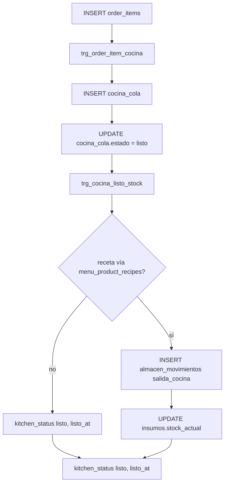

# Cocina, almacén (insumos), caja y semilla de `roles_modulos`

Si `supabase db pull` o `migration list` se quejan de historial, lee [MIGRACIONES_Y_DB_PULL.md](MIGRACIONES_Y_DB_PULL.md) (nombres únicos, docs fuera de `migrations/`, reparar historial en remoto).

## Unificación y encaje con el esquema operacional

- **Cocina / cola / almacén (insumos) / caja (columna) / semilla roles** — `20260428130000_mirest_cocina_modulos_sesion_caja.sql`
- **Puente e2e** (recomendado, después del bloque de arriba): `20260430180000_mirest_kitchen_caja_e2e_wiring.sql`  
  Crea `menu_product_recipes`, añade `recipes.yield_quantity`, columnas alias en `order_items` (`menu_product_id`, `item_name`, `notes`) y reemplaza las funciones de trigger para usar `public.products` (ID de plato), nombres `product_name` / notas, `dining_tables.label` y `orders` sin `table_id`.

Sustituye a la versión obsoleta `20260426200000_mirest_cocina_modulos_sesion_caja.sql`, que quedó con un **orden de dependencias incorrecto** respecto al núcleo operativo.

Aplicaciones por **MCP, SQL Editor o parches sueltos** (varios nombres de migración) equivalen al mismo cuerpo SQL: el repositorio usa **solo** el archivo unificado indicado abajo; no añadas copias del mismo bloque bajo otro timestamp salvo evolución real del esquema.

## Orden de migraciones requerido

| Orden | Archivo (en `supabase/migrations/`) | Qué aporta para esta migración |
|------|--------------------------------------|--------------------------------|
| 1 | Varios (acceso, RLS, etc. según tu capa) | `auth`, `user_profiles` |
| 2 | `20260428120000_mirest_operational_core.sql` | `tenants`, `restaurants`, `insumos`, `orders`, `order_items`, `cash_sessions`, `inventory_movements`, `recipes`, `recipe_ingredients`, … |
| 3 | `20260426120000_mirest_canonical_spanish_views.sql` (o el que defina) | `roles_modulos` con `UNIQUE (tenant_id, rol)` |
| 4 | `20260428130000_mirest_cocina_modulos_sesion_caja.sql` | Triggers, tablas, RLS, semilla |
| 5 | `20260430180000_mirest_kitchen_caja_e2e_wiring.sql` | `menu_product_recipes`, `yield`, alias en `order_items`, cuerpos de funciones alineados al `operational_core` |
| 6 | `20260430190000_mirest_kitchen_functions_rls_from_e2e_wiring.sql` | Solo RLS + `fn_trg_order_item_cocina` + `fn_cocina_listo_descuenta_stock` (útil si antes aplicaste 3018 a medias) |

Si el proyecto vinculado tuvo parches vía **MCP/Editor**, el `schema_migrations` puede mostrar otras `version` que el número del archivo; lo importante es que el **contenido** de las funciones y la política `mpr_tenant` estén al día (coalesce de `product_id`/`label` de mesa, `tenant` en `menu_product_recipes`).

**Dependencia:** con la migración (5) aplicada, `public.menu_product_recipes` y `recipes.yield_quantity` quedan definidos en el repositorio. Los alias en `order_items` evitan depender del nombre “menu” en columnas; el mapeo plato → receta usa `public.products` como `menu_product_id` (cada plato de carta con su `products.id`).

**Prueba SQL de extremo a extremo (no sustituye E2E de navegador):** [supabase/tests/README_E2E_KITCHEN_CAJA.md](../tests/README_E2E_KITCHEN_CAJA.md) y el script `supabase/tests/e2e_kitchen_caja.sql` (más el runner con rollback bajo `Pedidos/` → `npm run test:e2e:kitchen` si `DATABASE_URL` o `SUPABASE_DB_URL` está definida).

## Resumen de objetos

### Vistas

- `movimientos_inventario` → `SELECT * FROM public.inventory_movements` (nomenclatura; antes el nombre `almacen_movimientos` se usó como alias de inventario en inglés).
- Se hace `DROP VIEW IF EXISTS public.almacen_movimientos` para liberar el nombre; luego la **tabla** `almacen_movimientos` pasa a ser de **stock por insumo** (KDS / cocina / costos).
- `pedidos` → proyección de `orders` (incluye `sesion_caja_id` al recrear la vista).

### Columnas nuevas

- `order_items.kitchen_status` (`text`, default `pending`).
- `orders.sesion_caja_id` → FK a `cash_sessions`.

### Tablas

- `cocina_cola` — cola de preparación; una fila por `order_item` (índice único `order_item_id`).
- `almacen_movimientos` — movimientos a nivel `insumo_id` con `tipo` (entradas/salidas/ajustes) y trazas opcionales a `order_id`, `order_item_id`, `cocina_cola_id`.

### Funciones y triggers (PostgreSQL: `EXECUTE FUNCTION …`)

| Función | Trigger | Evento |
|---------|---------|--------|
| `fn_trg_order_item_cocina` | `trg_order_item_cocina` on `order_items` | `AFTER INSERT` → inserta en `cocina_cola` |
| `fn_cocina_listo_descuenta_stock` | `trg_cocina_listo_stock` on `cocina_cola` | `AFTER UPDATE OF estado` → al pasar a `listo`, genera `salida_cocina` y baja `insumos.stock_actual` si hay receta |

- `fn_seed_roles_modulos_for_tenant(tenant_id)` + `trg_tenants_seed_roles_modulos` on `tenants` `AFTER INSERT` (semilla de filas en `roles_modulos`).
- Bloque `DO` al final: **backfill** de `roles_modulos` para todos los `tenants` existentes (idempotente vía `ON CONFLICT`).

## Flujo operativo (alto nivel)

- Antidoble: si ya existen filas de `almacen_movimientos` con el mismo `cocina_cola_id` y `salida_cocina`, el trigger no vuelve a descontar.

## Row Level Security (RLS)

- `cocina_cola` y `almacen_movimientos`: políticas `*_tenant` para el rol `authenticated` comparando `tenant_id` con `user_profiles.tenant_id` donde `user_profiles.id = auth.uid()`.
- Los triggers usan `SECURITY DEFINER`; la capa de aplicación y las políticas siguen restringiendo lo que un usuario autenticado lee/escribe.

## Realtime

- Intento de `ALTER PUBLICATION supabase_realtime ADD TABLE public.cocina_cola` dentro de un `DO` con excepción, para no romper en entornos sin esa publicación.

## Cómo probar (resumen)

1. Con pedido e ítems reales, inserta una fila en `order_items` y comprueba aparición en `cocina_cola` con el mismo `order_item_id`.
2. Marca `cocina_cola.estado = 'listo'`; verifica:
   - fila(s) en `almacen_movimientos` con `tipo = 'salida_cocina'`;
   - reducción de `insumos.stock_actual` (si `recipe_ingredients` e `insumos` están alineados);
   - `order_items.kitchen_status = 'listo'`.

## Bases de datos que ya desplegaron el nombre antiguo

Si en el proyecto vinculado a Supabase la tabla `supabase_migrations` ya contiene un registro para `20260426200000_...` y ahora el repo **solo** tiene `20260428130000_...`:

- Clones y `db reset` locales usan el orden correcto.
- Proyecto remoto que **solo** tuvo el nombre viejo: no hace falta re-ejecutar el SQL entero si el cuerpo ya se aplicó; ajusta el historial con [`supabase migration repair`](https://supabase.com/docs/reference/cli/supabase-migration-repair) y con la [guía de migraciones](https://supabase.com/docs/guides/deployment/database-migrations) para que el estado de migraciones refleje el repositorio.
- Proyecto que aplicó el mismo cuerpo por el editor en tramos: el estado físico de la base puede ser correcto; repara o documenta un baseline para tu equipo.

## Módulos semilla en `roles_modulos`

Por tenant (simplificado; ver SQL para la lista completa de claves de módulo):

- `superadmin` → `['*']`
- `admin` → módulos operativos e IA amplios
- `caja` / `pedidos` → `pedidos`, `caja`, `clientes`
- `chef` → `cocina`, `almacen`, `recetas`, `productos`
- `almacen`, `marketing`, `soporte` → subconjuntos según el `INSERT` en la migración

Los valores se actualizan con `ON CONFLICT (tenant_id, rol) DO UPDATE` (requiere el constraint `UNIQUE` en `roles_modulos`).
